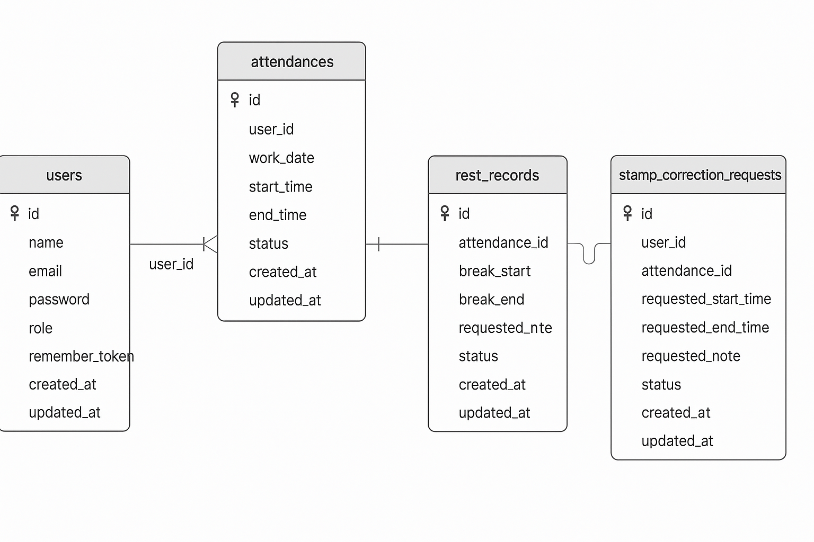

# 勤怠管理システム（Laravel + Fortify）

## 概要

このプロジェクトは、社員の出勤、退勤、休憩、効動時間などを管理するための **勤怠管理アプリ** です。

Laravel Fortify を使用して、一般ユーザーの登録、ログイン、メール認証から、勤怠情報の払い出しや修正申請、管理者による承認機能まで完備しています。

---

## 主な機能

- ログイン / 登録 / メール認証 (Fortify)
- 勤怠情報の払い出しと登録
- 休憩時間の記録 / 終了
- 修正申請と承認機能
- 管理者による勤怠管理

---

## 使用技術

- **Laravel**: Laravel 8.83.8
- **認証**: Laravel Fortify
- **フロントエンド**: Blade, CSS
- **DB**: MySQL（Docker対応）
- **テスト**: PHPUnit（Featureベース）
- **メール送信**: MailHog (開発環境)

---

## インストール手順

### 1. リポジトリクローン

```bash
git clone git@github.com:johndoe173/attendance-management.git
```

### 2. 環境変数の設定

```bash
cp .env.example .env
php artisan key:generate
```

### 3. Docker 組み込み

```bash
docker-compose up -d
composer install
```

### 4. DB マイグレーション & シード

```bash
php artisan migrate --seed
```

### 5. ストレージリンク

```bash
php artisan storage:link
```

---

## Fortify カスタマイズ

### 登録 / ログイン のバリデーション

`FortifyServiceProvider` 内で `authenticateUsing` を利用

```php
Validator::make($request->all(), [
  'email' => ['required', 'email'],
  'password' => ['required', 'string', 'min:8']
], [
  'email.required' => 'メールアドレスを入力してください',
  'password.required' => 'パスワードを入力してください',
])->validate();
```

- メール認証リダイレクト先：`/attendance`
- Blade用の証言メールビューを指定

---

## テスト構成

| ファイル                            | 内容                |
| ------------------------------- | ----------------- |
| Auth/LoginTest.php              | ログインのバリデーションテスト   |
| Auth/AdminLoginTest.php         | 管理者ログイン認証テスト      |
| Attendance/PunchTest.php        | 出勤 / 退勤 / 休憩の動作確認 |
| Attendance/DetailTest.php       | 勤怠詳細 & 修正申請テスト    |
| StampCorrection/RequestTest.php | 修正申請送信テスト         |
| Admin/AttendanceListTest.php    | 管理者勤怠一覧テスト        |
| Admin/StampApproveTest.php      | 修正申請承認テスト         |
| Email/VerificationTest.php      | メール認証フローテスト       |

---

## FormRequest バリデーション

| クラス                          | ライル     | 内容                              |
| ---------------------------- | ------- | ------------------------------- |
| LoginRequest                 | ログイン    | email, password 必須              |
| AdminLoginRequest            | 管理者ログイン | email, password 必須              |
| RegisterUserRequest          | 登録      | name, email, password 必須        |
| AttendancePunchRequest       | 払い出し    | 状態により動的に変化                      |
| StampCorrectionRequest       | 修正申請    | start\_time, end\_time, note 必須 |
| AdminAttendanceUpdateRequest | 管理者修正   | start\_time 必須                  |

---

## ER図


---
## URL

- アプリ本体: [http://localhost/](http://localhost/)
- phpMyAdmin: [http://localhost:8080/](http://localhost:8080/)
- Mailhog: [http://localhost:8025/](http://localhost:8025/)