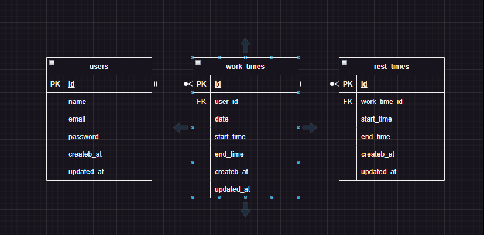

# AttendanceManagement(勤怠管理システム)

## 作成した目的
- 人事評価のため

## アプリケーションURL
- https://github.com/johndoe173/attendance-management

## 機能一覧
- 会員登録
- ログイン
- ログアウト
- Mailhogによる認証機能
- 勤務開始
- 勤務終了
- 休憩開始
- 休憩終了
- 日付別勤怠情報取得
- ページネーション
- ユーザーページ
- ユーザーごとの勤怠情報

## 環境構築
**Dockerビルド**
1. `git clone git@github.com:estra-inc/confirmation-test-contact-form.git`
2. DockerDesktopアプリを立ち上げる
3. `docker-compose up -d --build`

**Laravel環境構築**
1. `docker-compose exec php bash`
2. `composer install`
3. 「.env.example」ファイルを 「.env」ファイルに命名を変更。または、新しく.envファイルを作成
4. .envに以下の環境変数を追加
``` text
DB_CONNECTION=mysql
DB_HOST=mysql
DB_PORT=3306
DB_DATABASE=laravel_db
DB_USERNAME=laravel_user
DB_PASSWORD=laravel_pass
```
5. アプリケーションキーの作成
``` bash
php artisan key:generate
```

6. マイグレーションの実行
``` bash
php artisan migrate
```

7. シーディングの実行
``` bash
php artisan db:seed
```

**Mailhog**
1. 「docker-compose.yml」ファイルに以下の記述
``` text
mailhog:
  image: mailhog/mailhog:latest
  ports:
    - "8025:8025"
    - "1025:1025"
```
2. .envに以下の記述
``` text
MAIL_MAILER=smtp
MAIL_HOST=mailhog
MAIL_PORT=1025
MAIL_USERNAME=null
MAIL_PASSWORD=null
MAIL_ENCRYPTION=null
MAIL_FROM_ADDRESS="noreply@example.com"
MAIL_FROM_NAME="${APP_NAME}"
```
3. docker-compose up -dを実行。Laravelからメールを送信すると http://localhost:8025 でメール内容を確認

## 使用技術(実行環境)
- PHP8.3.0
- Laravel8.83.27
- MySQL8.0.26
- Fortify
- Mailhog

## ER図


## URL
- 開発環境：http://localhost/
- phpMyAdmin：http://localhost:8080/
-mailhog:http://localhost:8025/